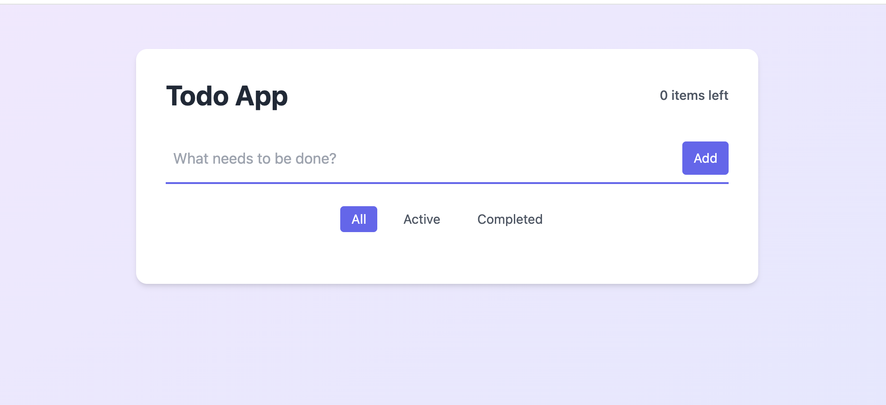

# chat.md: The File-First AI Conversation Interface

**Finally, AI chat that works like code: versioned, shareable, and in your editor.**

chat.md is a Visual Studio Code extension that reimagines AI interaction through plain text files. Unlike ephemeral web interfaces or proprietary chat windows, chat.md embraces a file-first approach where your conversations with AI are just markdown files with a `.chat.md` extension. Edit them, version control them, share them - they're your files.



## Why chat.md?

| Other AI Tools | chat.md |
|----------------|---------|
| ❌ Locked to a specific vendor's models | ✅ Use Claude, GPT, or any compatible API |
| ❌ Tool execution tied to proprietary implementations | ✅ Open MCP protocol for universal tool support |
| ❌ Conversations live in the cloud | ✅ Files stored locally alongside your code |
| ❌ Separate context from your workspace | ✅ Attach files directly from your project |
| ❌ Linear conversations only | ✅ Non-linear editing - rewrite history, branch conversations |
| ❌ Can't manually edit AI responses | ✅ Put words in LLM's mouth - edit and have it continue from there |
| ❌ Truncated outputs are lost forever | ✅ Resume incomplete AI responses at any point |
| ❌ Require constant context switching | ✅ Stay in your editor where you work |

## Features

### 🗣️ File-Based Conversations

Unlike Copilot's inline suggestions, ChatGPT's web interface, or Cursor's side panel, chat.md treats conversations as *first-class files* in your workspace:

```markdown
# %% user
How can I optimize this function?

[#file](src/utils.js)

# %% assistant
Looking at your utils.js file, I see several opportunities for optimization:

1. The loop on line 24 could be replaced with a more efficient map/reduce pattern
2. The repetitive string concatenation can be improved with template literals
...
```

### 🔌 Universal Model Support

- **Anthropic Claude**: All models (Opus, Sonnet, Haiku)
- **OpenAI**: GPT-4, GPT-3.5, and future models
- **Custom APIs**: Any OpenAI-compatible endpoint (Azure, Google Gemini, etc.)
- **Quick Switching**: Toggle between different models for different tasks

### 🛠️ Universal Tool Ecosystem with MCP

Unlike Cursor or Copilot's closed tool implementations, chat.md embraces the **Model Context Protocol (MCP)** - an open standard for tool execution that works with any LLM:

- **Truly Universal**: Any AI model (Claude, GPT, open-source models) can use any MCP tool
- **Model Agnostic**: Tools work identically regardless of which AI powers your conversation
- **Extensible**: Bring your own tools or use community-built ones
- **Local Control**: Tools run on your machine - no data leaves unless you want it to
- **Documentation-Driven**: Tools self-describe their capabilities to models
- **No Vendor Lock-in**: Switch models without losing tool functionality

```
<tool_call>
<tool_name>filesystem.searchFiles</tool_name>
<param name="pattern">*.js</param>
<param name="directory">src</param>
</tool_call>
```

### 📎 Contextual File Attachments

- Attach text files and images directly in your conversations
- Link files using familiar markdown syntax: `[#file](path/to/file)`
- Files are resolved relative to the chat document - perfect for project context

### 💾 Editable Conversations

Since chat.md files are just text, you have complete control over your AI interactions:

- **Non-linear Editing**: Rewrite history by editing earlier parts of the conversation
- **Conversation Hacking**: Put words in the AI's mouth by editing its responses
- **Continuation Control**: Have the AI continue from any edited point
- **Resume Truncated Outputs**: If an AI response gets cut off, just add a new assistant block and continue
- **Git-Friendly**: Track conversation changes, collaborate on prompts, and branch conversations
- **Conversation Templates**: Create reusable conversation starters for common tasks

## Getting Started

1. Install from the VS Code marketplace
2. Configure your API key(s):
   - Command Palette → "Configure chat.md API Key"
3. Create a new chat:
   - Command Palette → "New chat.md"
   - Or create any file with the `.chat.md` extension
4. Start your conversation:
   ```markdown
   # %% user
   Hello, can you help me with a coding question?

   # %% assistant
   
   ```
5. When you add an empty `# %% assistant` line, the AI automatically generates a response

## Configuration

Access these settings through VS Code's settings UI or settings.json:

- `chatmd.apiConfigs`: Named API configurations (provider, API key, model, base URL)
- `chatmd.selectedConfig`: Active API configuration
- `chatmd.mcpServers`: Configure MCP tool servers

## Keyboard Shortcuts

- `Shift+Enter`: Insert next block (alternates between user/assistant)
- `Alt+Cmd+'` (Mac) / `Alt+Ctrl+'` (Windows/Linux): Create new context chat
- `Alt+Cmd+Esc` (Mac) / `Alt+Ctrl+Esc` (Windows/Linux): Cancel streaming

## MCP Tool Integration

Connect any Model Context Protocol server to extend AI capabilities:

```json
"chatmd.mcpServers": {
  "filesystem": {
    "command": "node",
    "args": ["./mcp-tools/filesystem-server.js"]
  },
  "search": {
    "command": "python",
    "args": ["-m", "mcp_search_tools"]
  }
}
```

The AI will automatically discover available tools and know how to use them!

## The Philosophy

chat.md breaks away from the artificial "chat" paradigm and acknowledges that AI interaction is fundamentally about text processing. By treating conversations as files:

1. **Persistence becomes trivial** - no special cloud sync or proprietary formats
2. **Collaboration is built-in** - share, diff, and merge like any other code
3. **Version control is natural** - track changes over time
4. **Customization is unlimited** - edit the file however you want

## License

MIT License - see the LICENSE file for details.

## Feedback & Contributions

- File issues on the GitHub repository
- Contributions welcome via pull requests